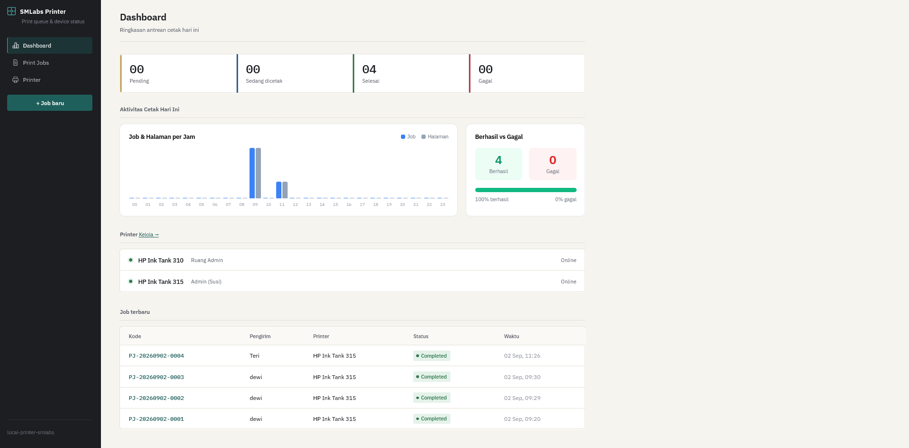
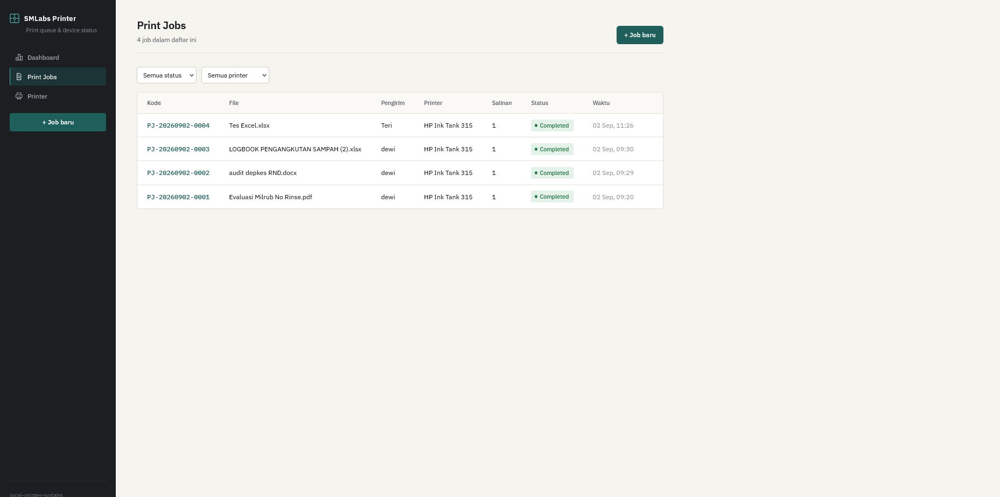
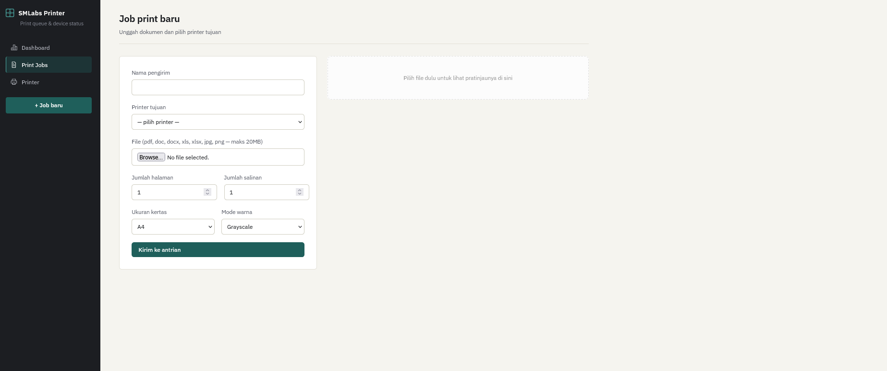
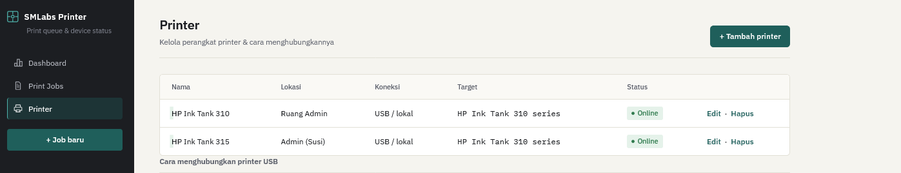
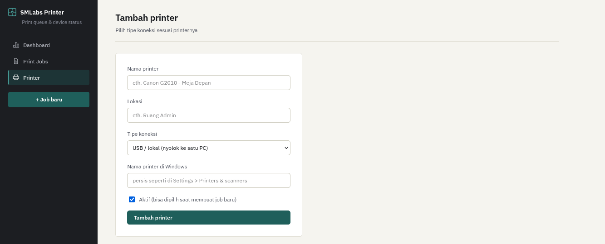

# Aplikasi Sharing Printer V1

Aplikasi Sharing Printer dalam satu jaringan bisa digunakan beberapa PC.

## Fitur
- Print Dokumen (Word,Excel,PDF)
- Print via Jaringan
- dll

## Tampilan

### Dashboard

### Print Job

### Creat Print Job

### Printer

### Creat Printer

## Install
- SumatraPDF
- LibraryOffice

## Cara Install
Hubungi :
email : teriwwwww@gmail.com
